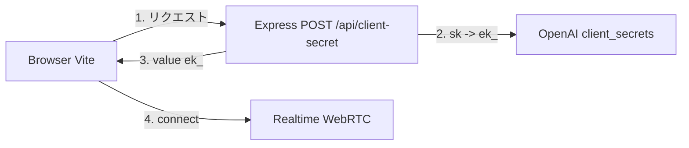

# AI Travel Assistant（旅行アシスタント）— Voice Agent Demo

Demo hội thoại giọng nói tiếng Nhật dùng **OpenAI Agents SDK** (`RealtimeAgent` + `RealtimeSession`) và **OpenAI Realtime API** (WebRTC trong trình duyệt). Backend Node.js chỉ tạo **ephemeral client secret** — không cần database.

## Kiến trúc (tóm tắt)



1. Trình duyệt tải UI, người dùng bấm **開始**.
2. Frontend gọi backend `POST /api/client-secret` → server gọi `https://api.openai.com/v1/realtime/client_secrets` với API key bí mật, trả về token dạng `ek_...`.
3. `RealtimeSession.connect({ apiKey: ek_... })` bật **WebRTC**, thu **microphone** và phát **âm thanh** phản hồi.
4. Agent: hướng dẫn bằng **tiếng Nhật (keigo cơ bản)**, công cụ `get_weather` trả dữ liệu **mock**; gợi ý du lịch trả lời trực tiếp.

Cấu trúc thư mục:

- [`frontend/`](./frontend) — Vite + TypeScript, `RealtimeAgent` + tool, UI.
- [`backend/`](./backend) — Express, một endpoint tạo ephemeral secret.

## Yêu cầu

- Node.js 20+
- Tài khoản OpenAI có quyền sử dụng **Realtime API** (và model `gpt-realtime-1.5`).

## Cài đặt

Từ thư mục gốc repo, cài từng gói:

```bash
cd backend
npm install
```

```bash
cd ../frontend
npm install
```

## Cấu hình API key

1. Tạo file `backend/.env` (bạn có thể copy từ `backend/.env.example`):

   ```env
   OPENAI_API_KEY=sk-proj-...
   PORT=3001
   ```

2. **Không** commit file `.env` lên git.

## Chạy local (demo)

Cần **hai terminal**:

**Terminal 1 — backend**

```bash
cd backend
npx tsx src/server.ts
# hoặc: npm run dev
```

Mặc định: `http://127.0.0.1:3001` (health: `GET /health`).

**Terminal 2 — frontend**

```bash
cd frontend
npm run dev
```

Mở trình duyệt: `http://127.0.0.1:5173` (Vite mặc định).  
Proxy Vite sẽ chuyển `POST /api/client-secret` tới backend — không cần CORS từ trình khi dùng URL trên cùng origin này.

### Build tĩnh + preview

```bash
cd frontend
npm run build
npm run preview
```

Khi preview (không có proxy Vite), đặt URL backend nếu cần (mặc định mã dùng `http://127.0.0.1:3001` khi không ở chế độ dev):

```text
# frontend/.env.production (ví dụ)
VITE_API_BASE=http://127.0.0.1:3001
```

## Luồng demo gợi ý (khách hàng Nhật)

1. Cấp quyền **マイク** (micro) khi trình duyệt hỏi.
2. Bấm **開始** — trạng thái: 聞いています → nói tiếng Nhật, ví dụ: 「東京の天気は？」— agent sẽ gọi `get_weather` và trả lời lịch sự.
3. Hỏi: 「京都で観光のおすすめを教えて」— câu trả lời tự nhiên (không bắt buộc dùng tool trừ khi hỏi thời tiết).
4. Bấm **停止** khi kết thúc.

Hội thoại và lệnh công cụ (mock) xuất hiện ở khu vực **会話**.

## Gói chính

- `@openai/agents` — `import { ... } from "@openai/agents/realtime"`
- `zod` ^4 (peer dependency của agents)

## Sự cố thường gặp

- **401 / 403 từ OpenAI** — API key hoặc quyền Realtime không hợp lệ.
- **Không có giọng / micro** — kiểm tra quyền, HTTPS/localhost, và tab không bị tắt thu âm.
- **Preview trống lỗi gọi API** — cấu hình `VITE_API_BASE` hoặc dùng `npm run dev` (có proxy).

## Giấy phép

Demo nội bộ / trình bày khách hàng — tuân theo [điều khoản OpenAI](https://openai.com/policies) và bản ghi nhớ API của tổ chức bạn.
